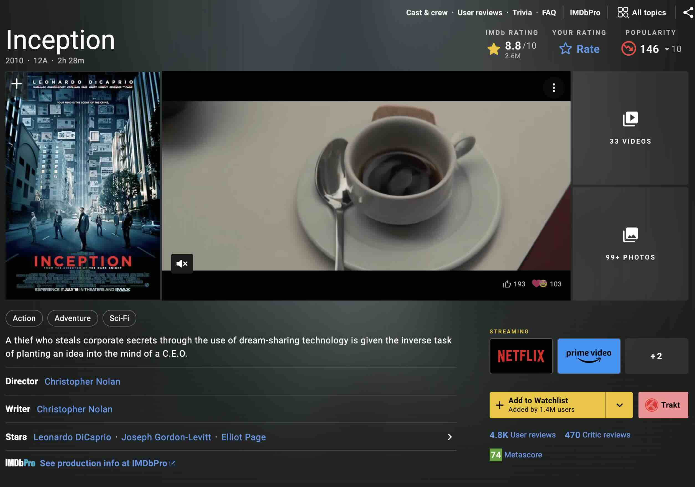

# IMDb to Trakt Redirect Extension

This Firefox extension allows users to easily navigate from IMDb movie pages to their corresponding pages on Trakt. When browsing a movie on IMDb, a "Trakt" button appears next to the existing "Add to Watchlist" button. Clicking this button will redirect the user to the appropriate Trakt page for the selected movie.

## Features

- **Easy Integration**: Adds a "Trakt" button next to the IMDb watchlist button.
- **Seamless Navigation**: Redirects users to the Trakt page for the selected movie.

## Installation

You can download the extension from the [Firefox Add-ons store](https://addons.mozilla.org/firefox/addon/imdb-to-trakt/).

## Permissions

The extension requires the following permissions:

- `activeTab`: Allows the extension to interact with the current tab the user is on.
- `tabs`: Used to open new tabs for the Trakt page.

### Why These Permissions Are Needed

- **`activeTab`**: Necessary for the extension to interact with the currently active IMDb tab.
- **`tabs`**: Required to open the Trakt page in a new tab when the user clicks the button.

## Usage

1. Navigate to any IMDb movie page.
2. Click on the "Trakt" button next to the "Add to Watchlist" button.
3. The corresponding movie page will open on Trakt, allowing you to view and manage it.

## Contributing

Contributions are welcome! Feel free to submit a pull request or open an issue if you have suggestions or encounter any problems.

## Screenshot

## License

This project is licensed under the MIT License. See the [LICENSE](LICENSE) file for more details.

## Acknowledgments

- [Trakt](https://trakt.tv/) for providing the movie tracking platform.
- [Mozilla](https://developer.mozilla.org/) for their documentation on Firefox extensions.
